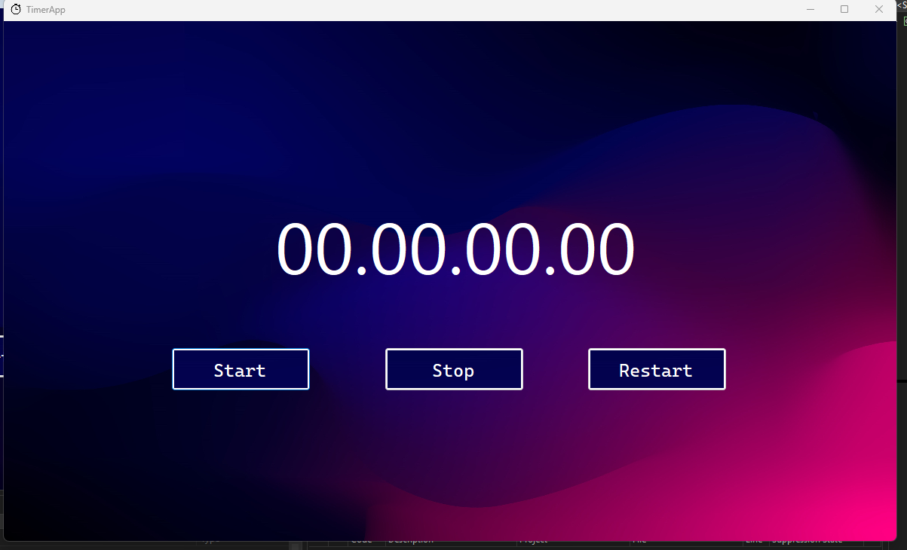
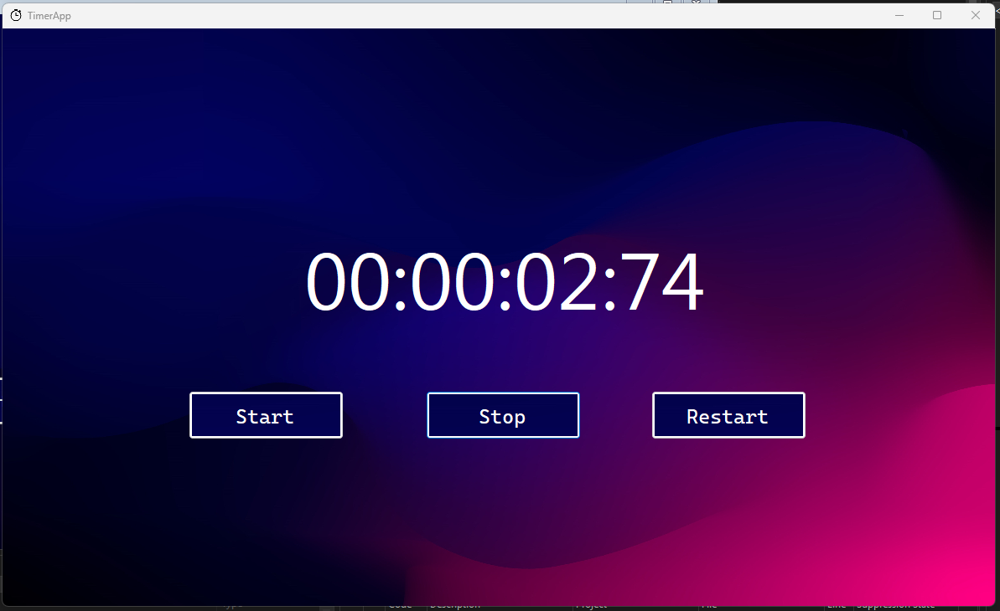

# TimerApp
## Make a Timer App using WPF .NET Framework in C# Language

## Ini adalah tugas untuk melakukan pembuatan aplikasi timer  dari mata kuliah Pemrogaman Berbasis Kerangka Kerja untuk mempratekkan penggunaan WPF dengan menggunakan bahasa C#. UI yang saya gunakan lebih berwarna sehingga menarik user untuk mencobanya.

### 1. Hasil Program

### 2. Waktu yang berjalan ketika distop

